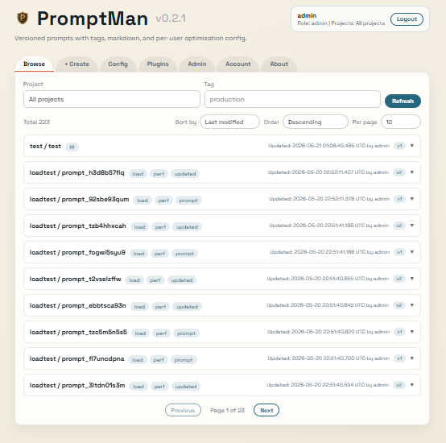
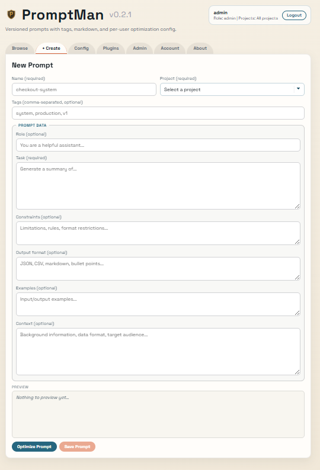
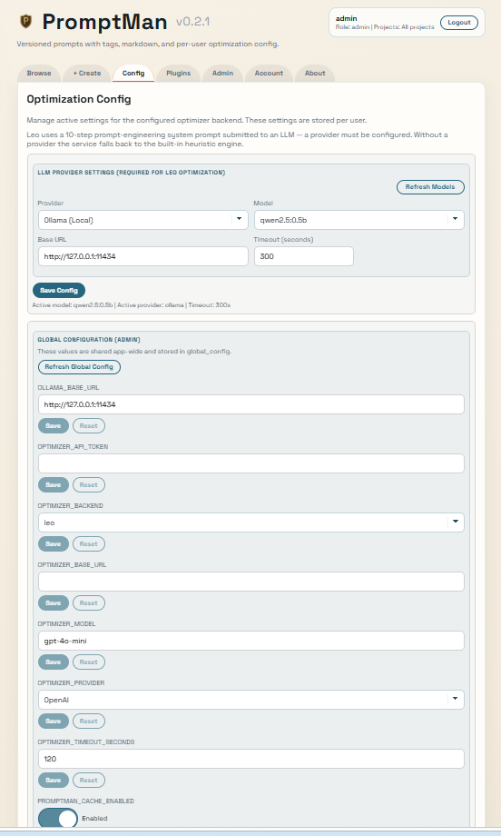
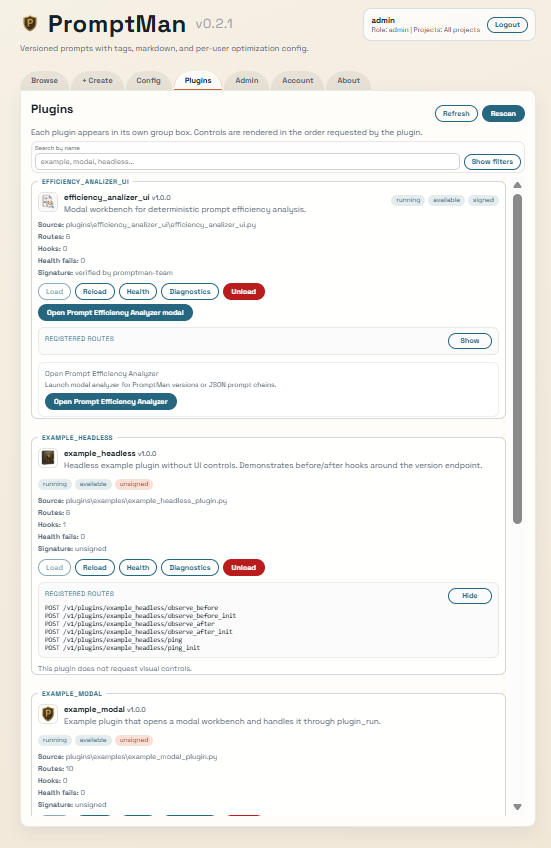
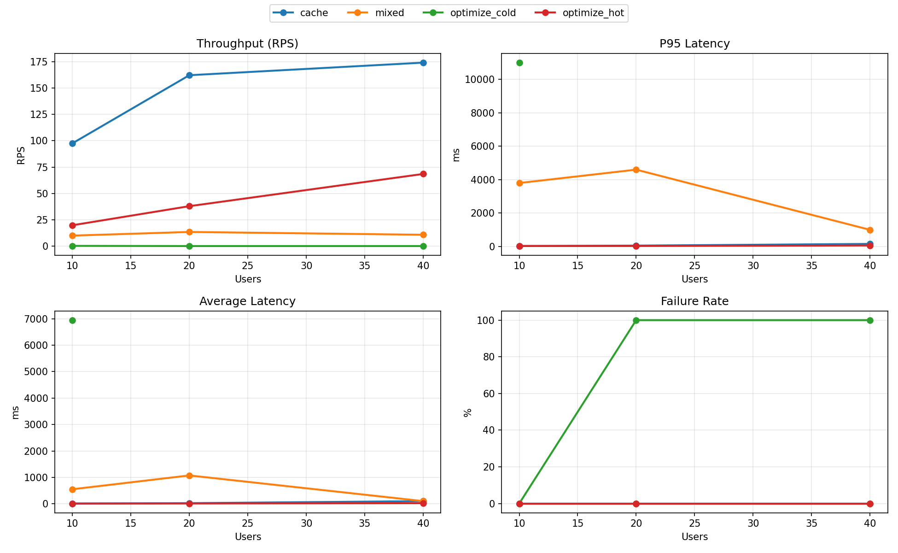
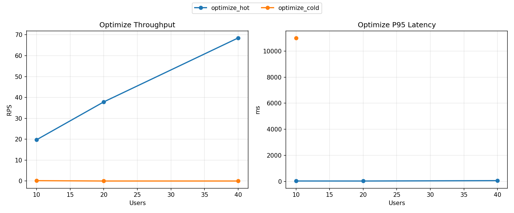
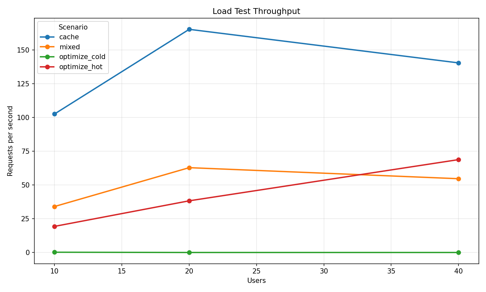
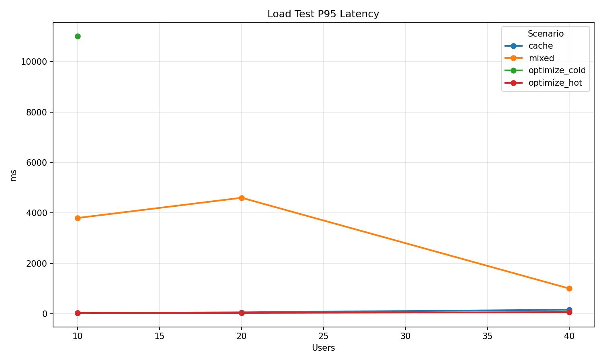
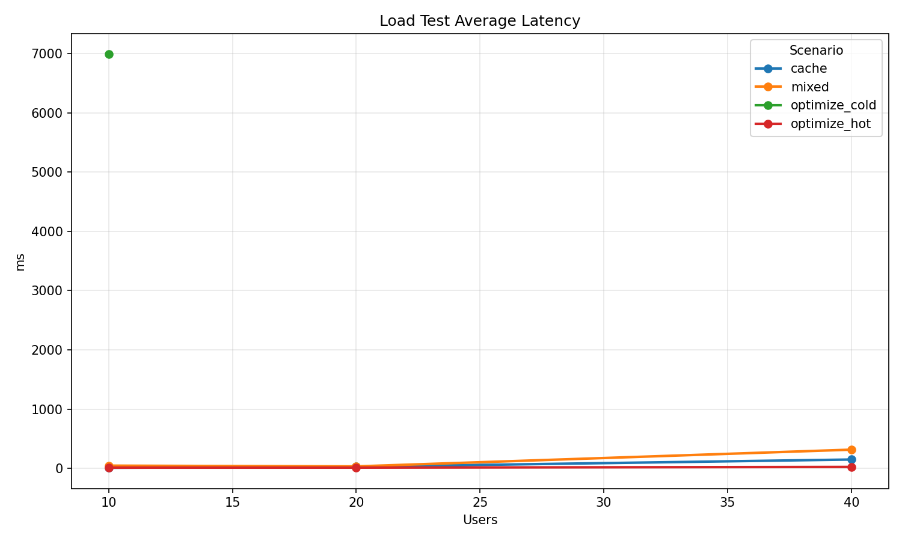
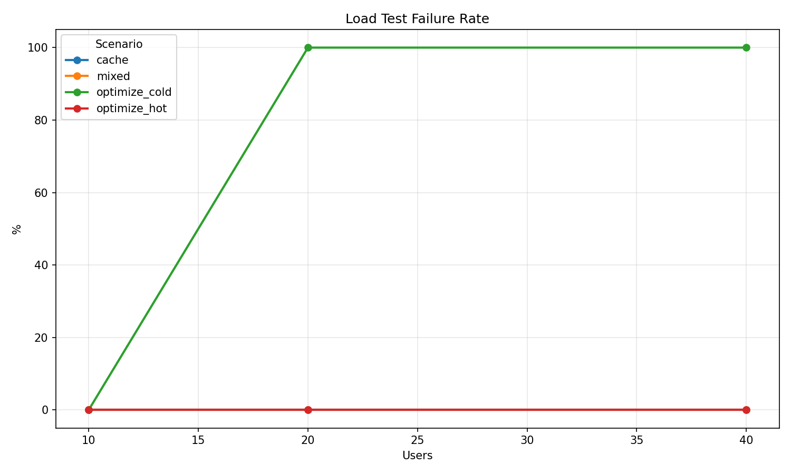

# Prompt Man

Prompt Man: FastAPI + Vue app for storing, versioning, and optimizing prompts.

Prompt Man is **REST API-first**: the primary product surface is the HTTP API, and the application architecture is optimized around API workflows.

The built-in UI is intentionally a secondary feature: a simple, convenient client for quick operations on top of the same REST API.

The project is aimed at small and medium teams that need concurrent multi-user access, role-based controls, and predictable API behavior under shared load.


## Program Snapshot






## Key Features

- **REST API-first** architecture with API endpoints as the primary integration surface.
- **REST API-first** workflow for automation, integrations, and CI/CD usage.
- UI as a secondary, intentionally simple and convenient client over the same REST API.
- Designed for small and medium teams with concurrent access needs and RBAC.

- Prompt storage by `project` + `name` with immutable version history.
- Structured prompt fields: `role`, `task`, `context`, `constraints`, `output_format`, `examples`.
- Tagging plus AND/OR search.
- Server-side prompt pagination with `X-Total-Count`.
- Prompt delete with cascading cleanup of versions and access data.
- Unified optimization path through pluggable optimizer backend.
- Optimization profiles: `fast`, `quality`, `ultra`.
- Multi-provider LLM support: Ollama, OpenAI, Anthropic.
- Dynamic provider model discovery.
- Per-user optimization config persisted in the database.
- Authentication for REST API and UI.
- 30-minute access tokens with refresh-token based session renewal.
- RBAC with `admin`, `developer`, and `viewer` roles.
- Admin UI for project CRUD, user CRUD, and project access assignment.
- Normalized database schema with dedicated `projects` and `roles` tables.
- Prompt audit metadata: created/updated timestamps plus the user who made the change.
- Semantic Versioning (SemVer) with runtime version endpoint (`GET /version`).
- Sensitive config values encrypted at rest.
- Automatic database migration on startup.
- Default bootstrap admin support for first run.

## Versioning (SemVer)

This project uses Semantic Versioning: `MAJOR.MINOR.PATCH`.

- `PATCH`
  - backward-compatible bugfixes and internal fixes
- `MINOR`
  - backward-compatible new features or endpoints
- `MAJOR`
  - any backward-incompatible API/behavior change

Current application version is defined in [pyproject.toml](pyproject.toml) under `project.version`.
At runtime the app exposes version info via:

```text
GET /version
```

Example response:

```json
{
  "name": "prompt-man",
  "version": "0.1.0"
}
```

### Release Bump Checklist

1. Decide bump type (`PATCH` / `MINOR` / `MAJOR`).
2. Update `project.version` in [pyproject.toml](pyproject.toml).
3. Run tests.
4. Commit with release note (for example: `chore(release): 0.2.0`).
5. Create git tag matching version (for example: `v0.2.0`).

## Requirements

- Python 3.11+
- `uv` recommended, or plain `pip`

## Setup

### Using uv

```powershell
uv sync --extra dev
.\.venv\Scripts\Activate.ps1
alembic upgrade head
```

### Using pip

```powershell
python -m venv .venv
.\.venv\Scripts\Activate.ps1
pip install -r requirements.txt
alembic upgrade head
```

## Run

```powershell
uvicorn main:app --reload
```

On startup the app applies Alembic migrations automatically before serving requests.

- UI: http://127.0.0.1:8000
- API docs: http://127.0.0.1:8000/docs

## First Run And Authentication

The application is protected by authentication for both UI and API access.

- On a clean database, the login screen switches into bootstrap mode.
- The first admin can be created through `POST /auth/bootstrap-admin` or from the UI.
- Startup also ensures a default admin exists when the database is empty.
- Current default bootstrap credentials are `admin` / `admin`.

Authenticated users receive a bearer token and all protected API routes require it.

Session behavior:

- Access token lifetime is 30 minutes.
- Login/bootstrap returns both an access token and a refresh token.
- `POST /auth/refresh` issues a new token pair when the access token has expired but the refresh token is still valid.
- The UI refreshes the session automatically on `401` caused by an expired access token.
- The UI also schedules a proactive refresh 1-3 minutes before access token expiry.

## RBAC And Access Model

- `admin`
  - full access to all prompts and all projects
  - can manage users, roles view, projects, and project assignments
- `developer`
  - can only access prompts in explicitly assigned projects
  - has personal optimization config but no admin management access
- `viewer`
  - can read all prompts and personal config
  - cannot create, update, optimize, or delete anything

Roles are stored in a dedicated `roles` table. API responses still expose role names such as `admin` and `developer`.

## Database Model

The database is normalized internally while the external prompt API still works with project names.

- `projects`
  - reference table for project names
- `prompts.project_id`
  - foreign key to `projects.id`
- `project_access.project_id`
  - foreign key to `projects.id`
- `roles`
  - reference table for RBAC roles
- `users.role_id`
  - foreign key to `roles.id`
- `configs.user_id`
  - one-to-one per-user optimization config
- `prompts.created_at` / `prompts.updated_at`
  - prompt-level audit timestamps
- `prompts.created_by_id` / `prompts.updated_by_id`
  - prompt-level audit actor references
- `prompt_versions.created_at`
  - version creation timestamp
- `prompt_versions.created_by_id`
  - version author reference

Deleting a project cascades to related prompt and access rows.

## UI Overview

UI is deliberately not the main product surface. Prompt Man is **REST API-first**, and the UI is intentionally kept simple and convenient as a companion client.

### Browse Tab

- View prompts by project/name.
- Filter by project and tag.
- Expand a prompt to inspect latest content and version history.
- See who created the prompt, who updated it last, and when those actions happened.
- All user-visible prompt audit timestamps are shown explicitly in UTC.
- Edit tags, create a new version, optimize, and delete prompts when the role has write access.
- Viewer sees the same data in read-only mode.

### Create Tab

- Create a prompt with required `name`, `project`, and `task`.
- Fill optional structured fields.
- Preview the composed prompt.
- Optimize before saving.

### Config Tab

- Manage personal optimization settings.
- Configure LLM provider, model, base URL, timeout, and token.
- Configure optimizer profile, model hint, and rounds.
- Save settings per user.
- Reuse the saved config in optimization and model discovery.
- Viewer can inspect config values but cannot save changes.
- The session banner shows UTC expiry time, a live expiry countdown, and the next scheduled refresh time.

### Admin Tab

Visible for admins only.

- Project CRUD.
- User CRUD.
- Assign project access to users.
- View role and active/inactive state.
- Project and user lists are scrollable to keep the page compact.

Viewer does not have access to this tab.

### Optimization Modal

- Shows optimization engine, notes, execution log, and composed markdown.
- Supports `Reoptimize` without leaving the modal.
- Supports applying optimized content back into Create or Browse flows.

### Session Handling In UI

- The sign-in screen explains the 30-minute access-token lifetime.
- The app retries authenticated API requests once after refreshing the session.
- The app schedules refresh automatically 1-3 minutes before token expiry.
- The session banner displays both the remaining access-token lifetime and the next scheduled refresh countdown.
- Prompt cards and version history show audit metadata directly in the UI.

## Per-User Optimization Config

Each user has a separate optimization config row in `configs`.

- `GET /optimize/config` returns the current user's config.
- `PUT /optimize/config` updates the current user's config.
- `POST /optimize` uses the current user's config.
- `GET /optimize/providers/{provider}/models` uses the current user's config as the default override source.

One user's changes do not modify another user's config.

## Optimization Features

### Prompt Optimization

Endpoint:

```text
POST /optimize
```

- Main UI optimize path.
- Uses active backend configured by `OPTIMIZER_BACKEND`.
- Falls back to heuristic mode when backend/provider call fails.

**How Leo optimization works:**

The default `leo` backend uses the `leo-prompt-optimizer` library.
Leo structures a 10-step prompt-engineering methodology (analyze intent → extract components → enhance clarity → add context → define persona → structure instructions → add examples → specify output format → optimize tokens → insert placeholders) and submits it to an **LLM via the configured provider**.
The LLM executes the structured rewrite based on that system prompt.
An LLM provider (Ollama, OpenAI, Anthropic, etc.) **must be configured** to use Leo; without it the service falls back to the built-in heuristic engine.

Profiles:

- `fast`
  - lowest cost / lowest latency
- `quality`
  - more candidates and filtering
- `ultra`
  - heaviest preset with more aggressive generation settings

### Backend Model Providers

- Supported provider families: OpenAI-compatible, Anthropic, Groq, Gemini, Mistral.
- Provider/model selection is controlled via per-user config and environment defaults.
- Ollama can be used in two ways:
  - `llm_provider: "ollama"` (native local profile)
  - `llm_provider: "openai"` with `llm_base_url` pointing to Ollama's OpenAI-compatible endpoint
    (the service auto-normalizes common local URLs like `http://127.0.0.1:11434` to `/v1`).

### Model Discovery

Endpoint:

```text
GET /optimize/providers/{provider}/models
```

- Ollama: discovered via provider API.
- OpenAI: discovered via provider API when a token is supplied.
- OpenAI + local Ollama base URL: discovered through Ollama `/api/tags` compatibility path.
- Anthropic: fixed built-in list.

## Optimization Config Example

```json
{
  "model_id": null,
  "rounds": 2,
  "gp_profile": "ultra",
  "llm_provider": "ollama",
  "llm_model": "qwen2.5:0.5b",
  "llm_base_url": "http://127.0.0.1:11434",
  "llm_timeout_seconds": 300,
  "llm_api_token": null
}
```

## Security Notes

- Password hashes are stored encrypted.
- LLM API tokens are stored encrypted.
- API responses never return plaintext token values.
- Tokens are decrypted only when needed for provider calls.
- Refresh tokens are signed and verified separately from access tokens.

## Environment Variables

- `DATABASE_URL`
  - default: `sqlite:///./prompts.db`
- `BOOTSTRAP_ADMIN_USERNAME`
  - optional first-run admin username override
- `BOOTSTRAP_ADMIN_PASSWORD`
  - optional first-run admin password override
- `PROMPTMAN_KEY`
  - encryption/signing key; set this explicitly for persistent deployments (especially Docker)
- `PROMPTMAN_KEY_PREVIOUS`
  - optional comma-separated list of older keys used for decryption fallback during key rotation/migration
- `OPTIMIZER_BACKEND`
  - active optimizer backend name (default: `leo`)
- `OPTIMIZER_MODEL_ID`
  - optional fallback model hint when no per-user override exists
- `OPTIMIZER_ROUNDS`
  - fallback round count
- `OPTIMIZER_PROFILE`
  - fallback profile: `fast`, `quality`, `ultra`
- `OPTIMIZER_PROVIDER`
  - fallback provider
- `OPTIMIZER_MODEL`
  - fallback model
- `OPTIMIZER_BASE_URL`
  - fallback provider base URL
- `OPTIMIZER_TIMEOUT_SECONDS`
  - fallback timeout
- `OPTIMIZER_API_TOKEN`
  - fallback encrypted token source

Per-user config returned by `/optimize/config` takes precedence over environment defaults for that user's optimize flows.

For Docker with a mounted database volume, keep `PROMPTMAN_KEY` stable between image updates/recreates. Example:

```powershell
docker run --name prompt-man --restart unless-stopped -p 8000:8000 -e DATABASE_URL=sqlite:////data/prompts.db -e PROMPTMAN_KEY="your-long-stable-secret" -v promptman-data:/data verycomplexandlongname/prompt-man:0.1.5
```

## API Surface

### Auth

- `POST /auth/bootstrap-admin`
- `POST /auth/login`
- `POST /auth/refresh`
- `GET /auth/status`
- `GET /auth/me`

`POST /auth/login`, `POST /auth/bootstrap-admin`, and `POST /auth/refresh` return:

- `access_token`
- `refresh_token`
- `access_token_ttl_seconds`
- `refresh_token_ttl_seconds`
- `access_token_expires_at`
- `refresh_token_expires_at`
- `user`

### Roles

- `GET /roles`

Admin-only read of available RBAC roles.

### Users

- `GET /users`
- `POST /users`
- `GET /users/{user_id}`
- `PUT /users/{user_id}`
- `PUT /users/{user_id}/projects`
- `DELETE /users/{user_id}`

### Projects

- `GET /projects`
- `GET /projects/{project_id}`
- `POST /projects`
- `PUT /projects/{project_id}`
- `DELETE /projects/{project_id}`

### Prompts

- `GET /prompts`
  - query params: `project`, `tag`, `limit`, `offset`
  - response header: `X-Total-Count`
  - each prompt includes `created_at`, `updated_at`, `created_by_username`, `updated_by_username`
- `GET /prompts/search`
  - query params: repeated `tags`, `mode`, optional `project`
- `POST /prompts`
- `GET /prompts/{project}/{name}`
- `PUT /prompts/{project}/{name}`
- `DELETE /prompts/{project}/{name}`
- `PUT /prompts/{project}/{name}/tags`
- `GET /prompts/{project}/{name}/versions`
- `GET /prompts/{project}/{name}/versions/{version}`

Each version response includes:

- `created_at`
- `created_by_username`
- prompt component fields

### Optimize

- `POST /optimize`
- `GET /optimize/config`
- `PUT /optimize/config`
- `GET /optimize/providers/{provider}/models`

## Prompt Uniqueness Rules

- Prompt identity is unique by `name + project_id` internally.
- Prompt versions enforce uniqueness for the full content tuple:
  - `role`, `task`, `context`, `constraints`, `output_format`, `examples`
- Duplicate version content returns `409 Conflict`.

## Notes For Operators

- The UI and API expose prompt projects by name for usability.
- The database stores project and role references by foreign key.
- If you inspect SQLite directly, expect `project_id` and `role_id` rather than string columns in normalized tables.

```text
GET /prompts?limit=10&offset=20
```

- `limit` and `offset` are optional.
- This allows API clients to either fetch the full collection or just a page/slice.

## Development

```powershell
ruff check .
ruff format .
mypy .
```

## Load Testing

This project includes repeatable load testing based on Locust and manifest-backed chart generation.
The harness now benchmarks four paths: the general mixed workload, a cache-heavy workload that repeatedly hits shared prompt-read and optimization-cache paths, a dedicated hot optimization workload, and a cold optimization workload that intentionally bypasses the optimization cache.

Load-test scenarios (including concurrent users at 10/20/40 levels) are intended to validate behavior for small and medium team usage patterns with simultaneous access.

### Run benchmark

```powershell
python loadtests/benchmark_rps.py --host http://127.0.0.1:8000 --duration 15s --users 10 20 40 --spawn-rate 10 --scenarios mixed cache optimize_hot optimize_cold --clean
```

### Build charts

```powershell
python loadtests/generate_charts.py
```

Charts are written to `loadtests/`.
When `loadtests/results/benchmark_manifest.json` exists, chart generation uses the manifest results directly, so stale CSVs and setup traffic do not pollute focused scenario graphs.

### Latest benchmark snapshot

Local benchmark snapshot (`15s`, `10/20/40` users, shared auth token, default thresholds `failure<=1%`, `p95<=500ms`):

| Scenario | Users | RPS | P95 (ms) | Avg (ms) | Failure % | Pass |
| --- | ---: | ---: | ---: | ---: | ---: | :---: |
| mixed | 10 | 24.17 | 1000.00 | 158.50 | 0.00 | no |
| mixed | 20 | 13.38 | 4600.00 | 1075.67 | 0.00 | no |
| mixed | 40 | 10.71 | 1000.00 | 104.25 | 0.00 | no |
| cache | 10 | 97.51 | 31.00 | 13.23 | 0.00 | yes |
| cache | 20 | 162.20 | 58.00 | 27.94 | 0.00 | yes |
| cache | 40 | 174.15 | 160.00 | 104.27 | 0.00 | yes |
| optimize_hot | 10 | 19.75 | 37.00 | 13.40 | 0.00 | yes |
| optimize_hot | 20 | 37.87 | 35.00 | 15.38 | 0.00 | yes |
| optimize_hot | 40 | 68.47 | 66.00 | 25.81 | 0.00 | yes |
| optimize_cold | 10 | 0.18 | 11000.00 | 6947.02 | 0.00 | no |
| optimize_cold | 20 | 0.00 | inf | inf | 100.00 | no |
| optimize_cold | 40 | 0.00 | inf | inf | 100.00 | no |

Observed takeaway:

- Mixed CRUD/search traffic is currently dominated by expensive optimize calls, so it misses the default p95 target even at 10 users on this local setup.
- Cache-heavy traffic still scales best on the same host, reaching about `174.15 RPS` at 40 users with `160 ms` p95 and zero failures.
- Dedicated hot optimization traffic reaches `19.75 RPS` at 10 users with `37 ms` p95, while dedicated cold optimization falls to `0.18 RPS` with `11 s` p95 on the same host. That is roughly a `110x` throughput gain and about a `297x` p95 reduction from cache reuse.
- At 20 and 40 users, the cold optimize scenario did not complete any optimize requests inside the 15-second window, while the hot optimize scenario remained stable with zero failures.

### Cache Impact Test

The repository now includes an executable unit test that measures the cache effect directly:

- `test_cached_optimization_is_faster_than_cold_optimization` in `tests/unit/test_unit_optimizer_and_crud.py`

It uses a deliberately slow fake optimizer backend and asserts that repeated cache hits complete materially faster than an equivalent series of cache misses.

### Chart: Dashboard



Combined view for quick comparison across scenarios and user levels:
- Throughput (`RPS`)
- P95 latency
- Average latency
- Failure rate

### Chart: Optimize Hot Vs Cold



Focused view for the dedicated optimization scenarios only. This isolates repeated identical optimize calls from cache-busting optimize calls so the optimization-cache effect is visible without prompt-read traffic mixed in.

### Chart: Throughput (RPS)



Shows how total request throughput changes as concurrent user count increases.
Use this graph to estimate sustainable request rate before latency degradation.

### Chart: P95 Latency



Shows tail latency behavior.
If this curve grows sharply, the service is near a bottleneck and user-facing response time becomes unstable.

### Chart: Average Latency



Shows general response-time trend under load.
Useful with P95 to distinguish overall slowdown from tail-only spikes.

### Chart: Failure Rate



Shows percentage of failed requests per run.
Combine this with latency and RPS to define production-ready capacity thresholds.

## Snippets

- Diagnostic one-off scripts are stored in `snippets/`.
- Current files:
  - `snippets/task_snippet.py` - runtime `/optimize/config` verification against running server.
  - `snippets/test_api.py` - local `TestClient` check for optimize config behavior.
  - `snippets/test_snippet.py` - direct helper-function check for non-string field normalization.

## Project Structure

```text
.
├── main.py
├── crud.py
├── models.py
├── schemas.py
├── optimizer_service.py
├── database.py
├── pyproject.toml
├── requirements.txt
├── snippets/
├── tests/
├── alembic/
└── ui/
```

## License

This project is licensed under the MIT License. See [LICENSE](LICENSE) for details.
